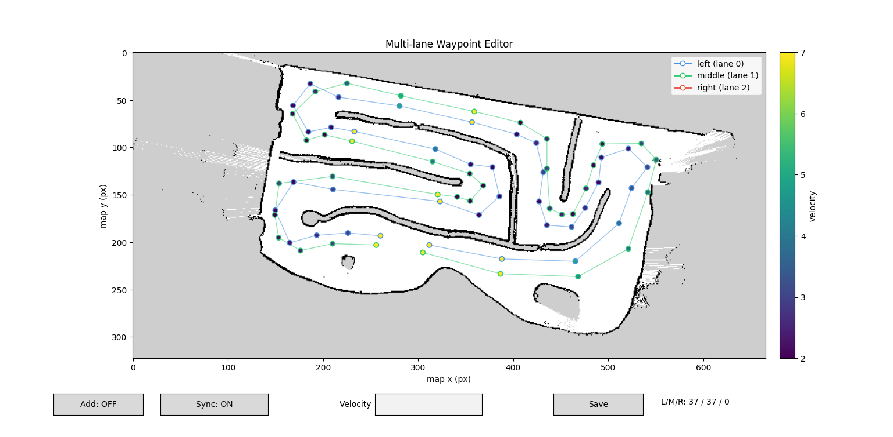
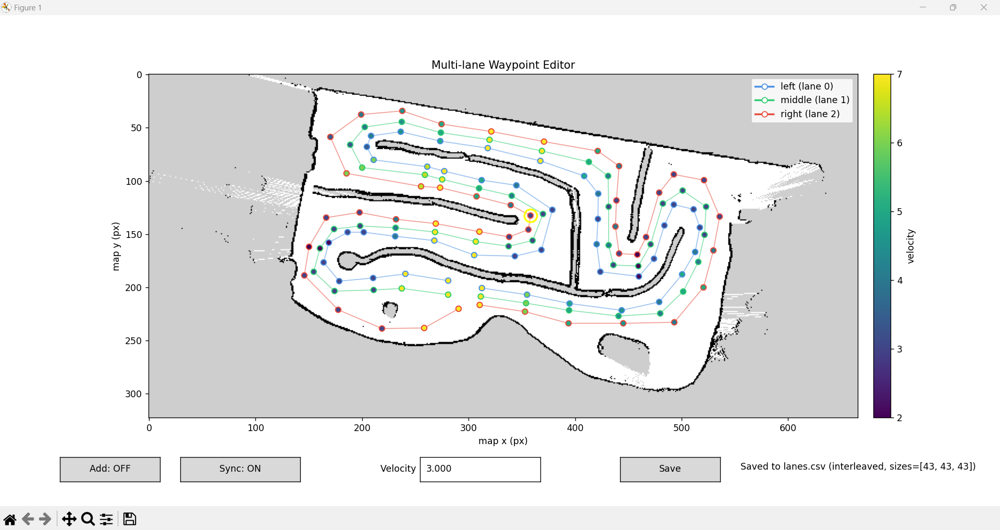

# F1TENTH Multi-Lane Pure Pursuit Stack


[](https://docs.ros.org/en/humble/)
[](https://releases.ubuntu.com/22.04/)
[](https://opensource.org/licenses/MIT)

A complete autonomous racing pipeline for the 1/10-scale F1TENTH platform, built around a **multi-lane pure pursuit controller** with LiDAR-based opponent detection. Designed for head-to-head racing and time trials, the stack reached a **21-second best lap** during competitive racing.

<p align="center">
  
  <br>
  <em>Final two-lane racing configuration overlaid on the SLAM map.</em>
</p>

---

## Table of Contents

- [Overview](#overview)
- [Key Features](#key-features)
- [Hardware](#hardware)
- [System Architecture](#system-architecture)
- [Multi-Lane Strategy](#multi-lane-strategy)
- [Installation](#installation)
- [Quick Start](#quick-start)
- [Repository Structure](#repository-structure)
- [Configuration Parameters](#configuration-parameters)
- [Waypoint Editor](#waypoint-editor)
- [Results](#results)
- [Limitations and Future Work](#limitations-and-future-work)
- [References](#references)

---

## Overview

This repository implements an end-to-end autonomous racing stack on top of ROS 2 Humble. Rather than relying on online replanning (RRT*, MPC, etc.), the controller selects on every iteration between two or three **pre-authored racelines** (lanes) that span the same lap. Each lane is index-aligned with its neighbors, which turns obstacle avoidance into a discrete, low-cost lane-selection problem evaluated at every pose update.

The pipeline has three offline stages and one online stage:

| Stage | Purpose | Tool |
|---|---|---|
| 1. Mapping | Build an occupancy grid of the track | `slam_toolbox` (online_async) at 1 m/s teleop |
| 2. Waypoint capture | Record a raw raceline | Forked MIT-RACECAR particle filter |
| 3. Waypoint curation | Shape the raceline by hand | Custom Python + Matplotlib editor |
| 4. Online control | Race | `pure_pursuit_node` (C++, this repo) |

---

## Key Features

- **Adaptive lookahead pure pursuit** — lookahead distance scales linearly with the reference speed, clamped between configurable bounds for stable cornering and straight-line tracking.
- **Multi-lane planning** — two or three index-aligned racelines selectable at runtime via a cost-based scorer.
- **LiDAR opponent detection** — range-jump segmentation + geometric cluster validation against the F1TENTH chassis footprint, with a two-frame persistence filter to reject noise.
- **Smooth collision cost** — exponential decay above a safety threshold and a hard penalty below it, with a switching penalty and cooldown timer to suppress oscillation.
- **Opponent-aware speed scaling** — graceful deceleration when an opponent is within the forward following window of the active lane.
- **Per-waypoint velocity profile** — hand-tuned target speeds per waypoint, including aggressive corner-entry deceleration that proved to be the single largest lap-time improvement.
- **Live RViz visualization** — color-coded lane markers, the active goal point, and confirmed opponents as cube markers.

---

## Hardware

| Component | Specification |
|---|---|
| Chassis | Traxxas 1/10-scale, brushed DC drive |
| Wheelbase | 0.3302 m |
| Steering | Servo, δ<sub>max</sub> = 0.4189 rad (~24°) |
| Speed controller | VESC (ROS 2 Ackermann bridge) |
| LiDAR | 2D SICK planar LiDAR (front-mounted) |
| Compute | NVIDIA Jetson Orin Nano Super (8 GB LPDDR5, 256 GB NVMe SSD) |
| OS / Middleware | Ubuntu 22.04 LTS + ROS 2 Humble |
| Teleop | Sony DualShock 4 |
| Mechanical top speed | ~40 mph (17.9 m/s) |

> [!NOTE]
> The controller is intentionally limited to a small fraction of the mechanical envelope. Target speeds in the curated raceline cap at **7 m/s on straights** and **2–3 m/s through corners**.

| Topic | Direction | Type |
|---|---|---|
| `/scan` | LiDAR → controller, PF | `sensor_msgs/LaserScan` |
| `/pf/viz/inferred_pose` | PF → controller (hardware) | `geometry_msgs/PoseStamped` |
| `/ego_racecar/odom` | Sim → controller | `nav_msgs/Odometry` |
| `/drive` | Controller → VESC | `ackermann_msgs/AckermannDriveStamped` |
| `/waypoints_viz`, `/goal_waypoint_viz`, `/opponents_viz` | Controller → RViz | `visualization_msgs/Marker[Array]` |

The same controller binary runs against either real-hardware localization or the F1TENTH simulator's ground-truth odometry, controlled by the `use_odom` parameter.

---

## Multi-Lane Strategy

The controller is written against a fixed three-lane interface (`lane_id ∈ {0, 1, 2}`). During development we tested both **two-lane** and **three-lane** configurations:

<p align="center">
  
  
  <br>
  <em>Left: final competition setup with two physical racelines. Right: three-lane experimental setup.</em>
</p>

**Two lanes** gave a sharper distinction between an "attack" line (tight apex) and a "defensive" line (wide, outside), making lane switching more meaningful. **Three lanes** offered more granularity, but lanes ended up too close together to provide a real avoidance advantage given LiDAR clustering tolerances. We competed with the two-lane configuration, duplicating one lane to satisfy the controller's three-lane contract.

### Lane scoring

On every pose update, each candidate lane ℓ is scored as:

```
J(ℓ) = J_collision(ℓ) + W_LR · ℓ + W_sw · 𝟙[ℓ ≠ ℓ_active]
```

where:

- `J_collision(ℓ)` uses a smooth exponential decay above the safety threshold (0.35 m clearance) and a hard penalty (100.0) below it.
- `W_LR = 0.5` is a leftward racing-line preference matching the track's dominant turn direction.
- `W_sw = 0.3` discourages switching when costs are close.
- A **0.5 s cooldown** suppresses oscillation, **overridden** when the active lane is itself blocked.

The full cost model and pseudocode are documented in the [project report](./report/F1_Race_Report.pdf).

---

## Installation

### 1. Prerequisites

- ROS 2 **Humble** on Ubuntu 22.04
- NVIDIA Jetson Orin Nano Super flashed with JetPack
- Completed F1TENTH hardware bring-up (VESC udev rules, power board, SICK LiDAR wired and powered)
- Default login on the Jetson is `nvidia` / `nvidia` — **change the password immediately**

Refer to the course lab documents for battery safety and power-board wiring before powering anything on.

### 2. External Dependencies

Install the system packages and clone external repositories into your workspace:

```bash
# slam_toolbox for offline mapping
sudo apt install ros-humble-slam-toolbox ros-humble-foxglove-bridge

mkdir -p ~/f1tenth_ws/src
cd ~/f1tenth_ws/src

# SICK LiDAR driver
git clone https://github.com/SICKAG/sick_safetyscanners2.git

# range_libc (required by the particle filter)
git clone -b humble-devel https://github.com/f1tenth/range_libc.git
pip3 install --user Cython==3.0.12 transforms3d
sudo apt install gcc-11 g++-11
cd range_libc/pywrapper && WITH_CUDA=ON python3 setup.py install --user
cd ../..

# Forked MIT-RACECAR particle filter (ROS 2 Humble port)
git clone -b humble-devel https://github.com/f1tenth/particle_filter.git
```

### 3. Python Requirements

For the waypoint editor:

```bash
pip install numpy matplotlib scipy
```

### 4. Build the Workspace

```bash
cd ~/f1tenth_ws/src
git clone <this-repo-url> pure_pursuit

cd ~/f1tenth_ws
rosdep install -r --from-paths src --ignore-src --rosdistro humble -y
colcon build --symlink-install
source install/setup.bash
```

> [!TIP]
> Add `source ~/f1tenth_ws/install/setup.bash` to your `~/.bashrc` so every new shell picks up the workspace.

---

## Quick Start

Run the following in order. Each step assumes a fresh terminal with the workspace sourced.

### Step 1. Hardware Bring-up

```bash
ros2 launch f1tenth_stack sick_bringup_launch.py
```

This starts the SICK LiDAR driver, the VESC interface, and the joystick teleop node. Confirm `/scan` and `/odom` are publishing with `ros2 topic hz`.

### Step 2. Initial Localization Setup

Physically nudge the car a few centimeters (manually or with the joystick). This gives the particle filter fresh scan data and a small motion update before it begins inference. **Skipping this step often results in the filter converging to the wrong pose.**


### Mapping the Track (One-Time Setup)

Before racing, you need an occupancy grid of the track. Launch `slam_toolbox` in asynchronous online mode with the F1TENTH-tuned config:

```bash
ros2 launch slam_toolbox online_async_launch.py \
  slam_params_file:=/home/nvidia/f1tenth_ws/src/f1tenth_system/f1tenth_stack/config/f1tenth_online_async.yaml
```

Then drive the car **manually with the joystick at ~1 m/s** for one full lap. The slow speed is important — higher teleop speeds introduce scan registration drift on featureless straights and prevent the start/finish region from closing cleanly into a loop.

While mapping, you can monitor progress in Foxglove or RViz by subscribing to `/map` and `/scan`. Once the lap closes and the map looks visually correct, save it with the `slam_toolbox` `/slam_toolbox/save_map` service or via the RViz panel.

> [!TIP]
> If the loop fails to close, restart and drive even slower. Re-mapping is cheaper than fighting a bad map for the rest of the project.

### Step 3. Start the Particle Filter

```bash
ros2 launch particle_filter localize.launch.py
```

Watch the pose converge in RViz or Foxglove. The published topic is `/pf/viz/inferred_pose`.

### Step 4. Visualization

```bash
ros2 launch foxglove_bridge foxglove_bridge_launch.xml
```

Open Foxglove Studio (or RViz) and subscribe to `/waypoints_viz`, `/goal_waypoint_viz`, `/opponents_viz`, and `/scan` to monitor the controller in real time.

### Step 5. Run the Controller

> [!IMPORTANT]
> Place your curated `lanes.csv` (columns: `x, y, v, lane_id`) at the workspace root:
>
> ```
> ~/f1tenth_ws/lanes.csv
> ```

Launch the controller:

```bash
ros2 run pure_pursuit pure_pursuit_node \
  --ros-args \
  -p waypoint_file:=$HOME/f1tenth_ws/lanes.csv \
  -p use_odom:=false \
  -p velocity:=2.0
```

For simulation, set `use_odom:=true` and run against the F1TENTH gym:

```bash
ros2 run pure_pursuit pure_pursuit_node \
  --ros-args \
  -p waypoint_file:=$HOME/f1tenth_ws/lanes.csv \
  -p use_odom:=true
```

> [!WARNING]
> Always keep the joystick **deadman switch** in reach. The first hardware run on a new map can produce unexpected steering until the particle filter fully converges.

---

## Configuration Parameters

All parameters are declared in `pure_pursuit_node.cpp` and can be overridden at launch via `--ros-args -p name:=value` or through `config/params.yaml`.

### Pure Pursuit

| Parameter | Default | Description |
|---|---:|---|
| `waypoint_file` | `""` | Absolute path to the CSV raceline file |
| `lookahead_distance` | 0.8 m | Fallback lookahead when adaptive mode is off |
| `lookahead_gain` | 0.5 s | Slope of the adaptive lookahead (L = k · v) |
| `min_lookahead` | 0.5 m | Lower clamp on adaptive lookahead |
| `max_lookahead` | 2.0 m | Upper clamp on adaptive lookahead |
| `velocity` | 0.8 m/s | Default fallback speed |
| `max_steering_angle` | 0.4189 rad | δ<sub>max</sub> |
| `wheelbase` | 0.3302 m | Vehicle wheelbase |
| `use_odom` | `true` | `true` for simulator, `false` for hardware (PF pose) |
| `speed_lookahead` | `true` | Enable adaptive lookahead |
| `min_speed_for_lookahead` | 0.5 m/s | Floor speed when computing adaptive lookahead |

### Lane Scoring and Opponent Detection

| Parameter | Default | Description |
|---|---:|---|
| `scan_topic` | `/scan` | LiDAR topic |
| `scoring_horizon_m` | 3.0 m | Forward arc length used to score lanes |
| `safety_threshold_m` | 0.35 m | Clearance below which a lane is "blocked" |
| `follow_distance_m` | 1.5 m | Distance over which the speed scale ramps |
| `min_speed_scale` | 0.3 | Lower bound on speed scaling near opponents |

### Hardcoded Constants

These are intentionally not exposed as parameters to lock down behavior between testing sessions. See `pure_pursuit_node.cpp` to modify:

| Constant | Value | Role |
|---|---:|---|
| `SWITCH_COOLDOWN_S` | 0.5 s | Minimum interval between lane switches |
| `CLUSTER_RANGE_JUMP_M` | 0.20 m | Range-jump segmentation threshold |
| `CLUSTER_MIN/MAX_POINTS` | 3 / 40 | Cluster size bounds |
| `CLUSTER_MIN/MAX_WIDTH_M` | 0.03 / 0.40 m | Cluster chord-width bounds |
| `CLUSTER_MAX_RANGE_M` | 6.0 m | Detection range cutoff |
| `LEFTWARD_PREFERENCE_W` | 0.5 | Leftward bias in lane cost |
| `SWITCHING_PENALTY_W` | 0.3 | Switching penalty |
| `COLLISION_PENALTY_W` | 100.0 | Hard penalty for blocked lanes |
| `OPP_PERSISTENCE_FRAMES` | 2 | Cross-frame confirmation requirement |
| `OPP_ASSOC_RADIUS_M` | 0.5 m | Inter-frame association radius |

---

## Waypoint Editor

The Python editor in `scripts/laneview.py` is the primary tool for shaping the raceline. It overlays the SLAM occupancy grid as a grayscale background and supports:

- **Drag** an existing waypoint to a new position
- **Insert** a waypoint between two existing ones (right-click)
- **Delete** the currently selected waypoint
- **Edit** per-waypoint target speed via a keyboard shortcut
- **Save** to `lanes.csv` in the workspace-root CSV format

```bash
cd scripts
python3 laneview.py --map ../maps/houston_track.yaml --waypoints ../lanes.csv
```

### Curation Strategy

Two heuristics produced the best lap times:

1. **Density follows curvature.** Place a waypoint at corner entry, apex, and exit. Straights need only 1–2 widely spaced anchors. The final curated raceline contains roughly **30 waypoints per lane**.
2. **Decelerate aggressively at corner entry.** Drop the first waypoint of each significant corner to **2 m/s** even if the rest of the corner runs at 3 m/s. The vehicle scrubs speed sharply on entry and carries momentum cleanly through the apex. This single change eliminated the early corner-understeer crashes during testing.

> [!TIP]
> Run the controller at low speed (e.g., `velocity:=1.5`) against your latest `lanes.csv` before pushing target speeds higher. Most "the car crashed" symptoms are actually waypoint placement or velocity-profile issues, not controller bugs.

---

## Results

| Metric | Value |
|---|---|
| Best lap time (competition) | **21 s** |
| Best testing config | 2-lane racelines, 30 waypoints/lane |
| Top straight-line speed | 7 m/s |
| Corner-entry speed | 2 m/s |
| Average corner speed | 3 m/s |

### Key Achievements

- Reliable lap completion on the physical track once the corner-entry velocity heuristic was tuned in.
- Smooth lane transitions under cooldown control with no high-frequency oscillation during obstacle-present testing.
- Successful sim-to-real transfer: the same binary ran in the F1TENTH gym and on hardware with only the `use_odom` flag changed.

### Demo Video

[Final Race](https://drive.google.com/file/d/1hFVOUjNZ9qzWWEVICL0WtxAmRXcmCYrg/view?usp=sharing)

---

## Limitations and Future Work

**Known limitations:**

- **Spurious lane oscillation without opponents.** During time trials with no opponent present, the controller occasionally toggles between candidate lanes due to small differences in the smooth clearance cost interacting with the leftward preference and switching penalty. The cooldown suppresses but does not eliminate this. A clean fix is to gate the lane scorer on the existence of at least one confirmed opponent and pin to a designated primary raceline otherwise.
- **Side-on collision blind spot.** A 2D front-mounted LiDAR cannot see a vehicle approaching the rear quarter. We were contacted side-on during one race and could not react in time. This is a sensor-coverage limitation and requires an additional rear-facing range sensor.
- **Single-lane baseline never run.** We treated multi-lane as the design baseline from day one; controlled ablation of the lane-switching machinery was not run.

**Planned future work:**

1. **Gap-follower handoff on opponent detection.** Run multi-lane pure pursuit until an opponent is confirmed, then hand off to follow-the-gap for the duration of the engagement.
2. **Learning-based opponent prediction.** Replace the two-frame persistence filter with a Kalman filter or constant-turn-rate model on confirmed clusters to recover opponent velocities, enabling lanes to be scored on *future* clearance rather than instantaneous clearance.
3. **Offline raceline optimization.** Standard minimum-curvature or minimum-time optimization on the post-SLAM track polygon will likely yield several tenths per lap over the manually-shaped lines.

---
University of Pennsylvania — F1TENTH Autonomous Racing.
---

## References

[1] R. C. Coulter, *Implementation of the Pure Pursuit Path Tracking Algorithm*, Tech. Rep. CMU-RI-TR-92-01, The Robotics Institute, Carnegie Mellon University, Pittsburgh, PA, January 1992.

### Related Projects and Tools

- [F1TENTH](https://f1tenth.org/) — Platform documentation and lab materials.
- [`slam_toolbox`](https://github.com/taherk-robo/slam_toolbox_panel) — ROS 2 SLAM package used for mapping.
- [`particle_filter`](https://github.com/mit-racecar/particle_filter) — MIT-RACECAR Monte Carlo localization (we use the [F1TENTH Humble fork](https://github.com/f1tenth/particle_filter)).
- [`range_libc`](https://github.com/f1tenth/range_libc/tree/humble-devel) — Fast ray-marching backend for the particle filter.
- [Foxglove Studio](https://foxglove.dev/) — Visualization and debugging.

---

## License

This project is released under the MIT License. See [`LICENSE`](./LICENSE) for details.